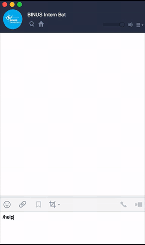

# BINUS Intern Logbook LINE Chatbot

This is a LINE Chatbot created to fill and show logbook from BINUS Internship website. This chatbot is created to help fill and show logbook when accessing the website directly is not an option.

Additional features include autofiller for the logbook. THe bot will autofill the logbook with "Day Off" on weekend, and will fill with the last log on weekday.

### Demo


### Data Structure
When data in the logbook is scraped using Puppeteer, we save it in form of a JSON API so that it can be accessed by the LINE bot.

```json
[
    {
        "date": "",
        "clock": {
            "in": "",
            "out": ""
        },
        "activity": "",
        "description": ""
    }
]
```

These enables user to search the log via LINE by date, and get all the data, to make sure the logs are in without going to the website.

### Installation
Assuming you already have Node.js installed in your device, to install the project, you can clone this repository to your device, then follow these steps:

```
cd intern-logbook-chatbot
npm install
```

### Deployment
If you are planning to use this bot yourself, below we list the tutorials to;
- Integrate autofill feature with Github Actions [here]()
- Deploy LINE Chatbot with LINE Developer and Heroku [here]()

### Resources
For this project, I use Puppeteer for web scrapping, Express.js and LINE SDK.

- Puppeeteer - [https://github.com/puppeteer/puppeteer](https://github.com/puppeteer/puppeteer)
- Express.js - [https://expressjs.com/](https://expressjs.com/)
- Line Bot SDK - [https://line.github.io/line-bot-sdk-nodejs/](https://line.github.io/line-bot-sdk-nodejs/getting-started/basic-usage.html#configuration)
